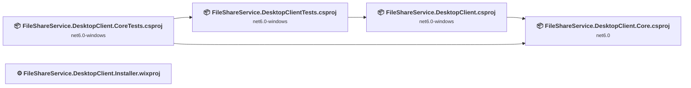
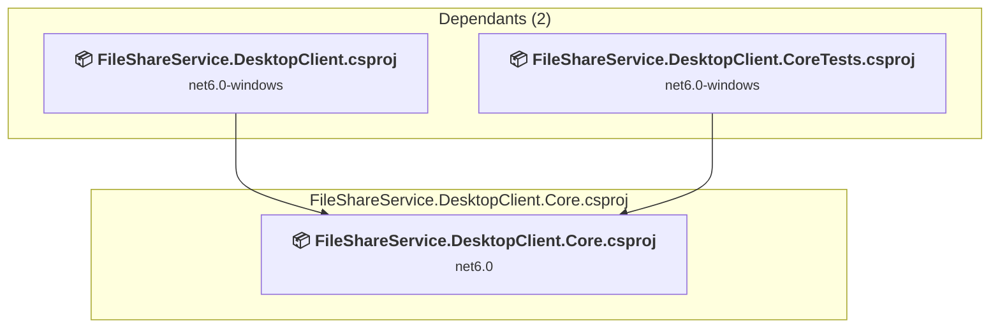
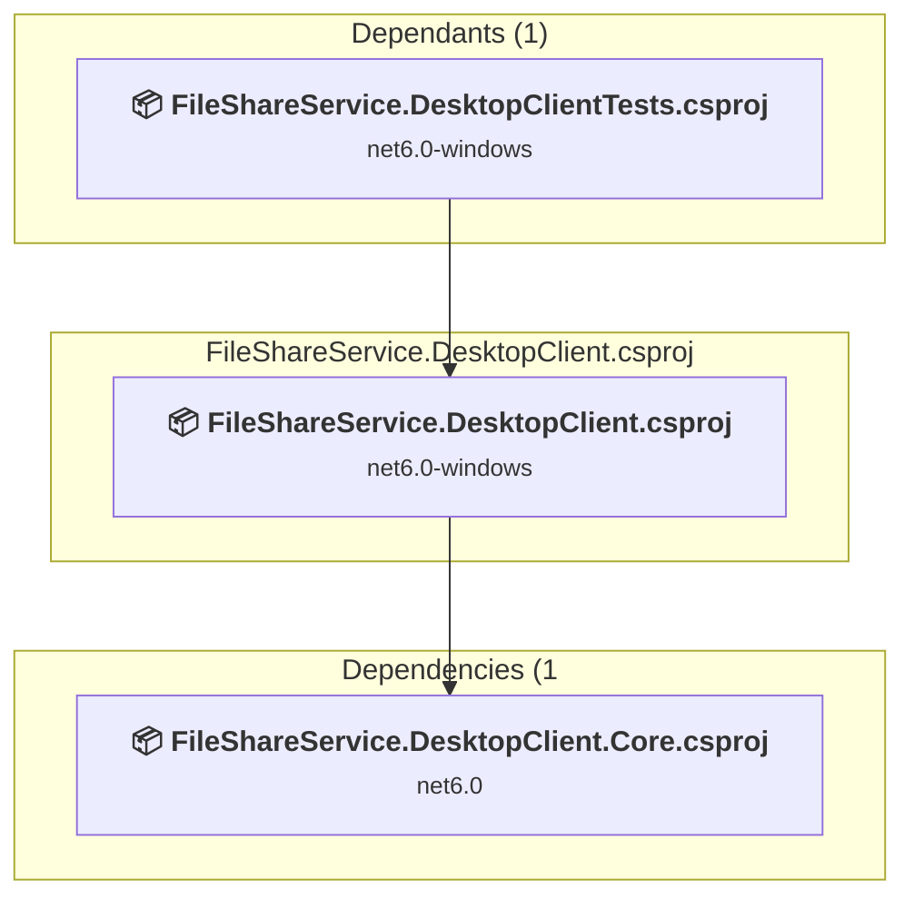
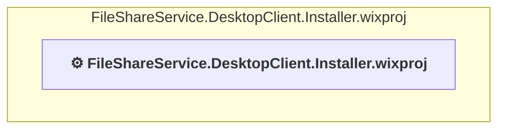
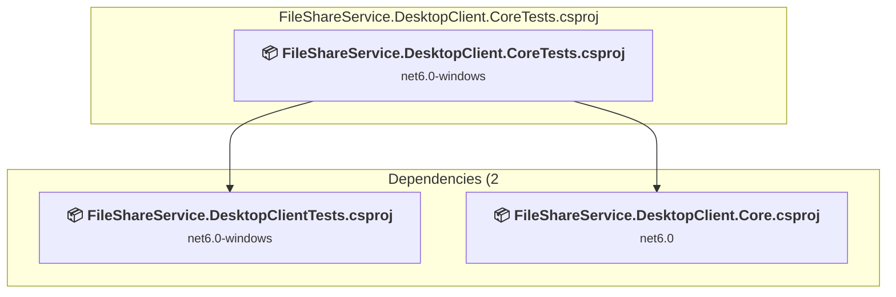
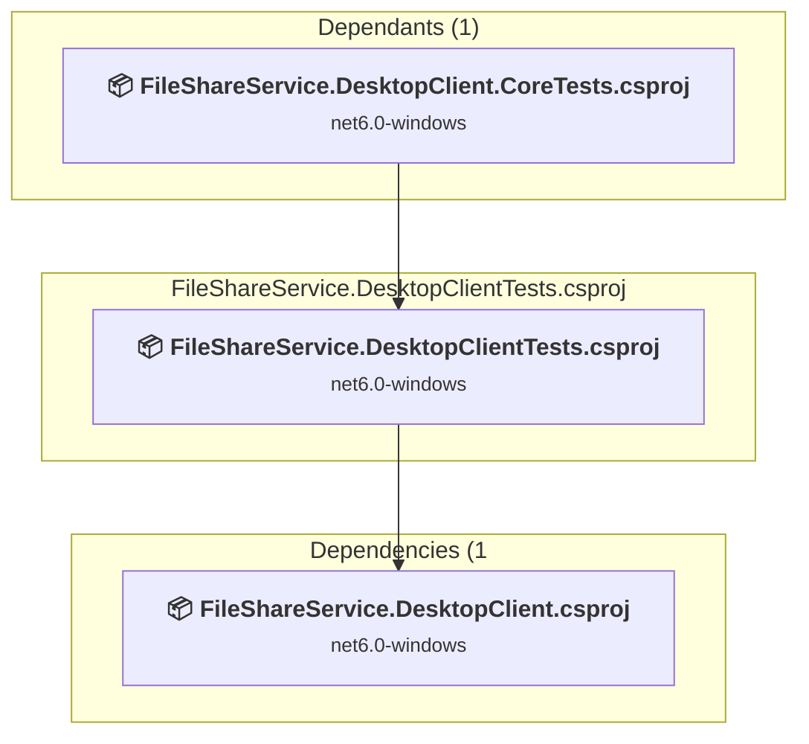

# Projects and dependencies analysis

This document provides a comprehensive overview of the projects and their dependencies in the context of upgrading to .NETCoreApp,Version=v8.0.

## Table of Contents

- [Executive Summary](#executive-Summary)
  - [Highlevel Metrics](#highlevel-metrics)
  - [Projects Compatibility](#projects-compatibility)
  - [Package Compatibility](#package-compatibility)
  - [API Compatibility](#api-compatibility)
- [Aggregate NuGet packages details](#aggregate-nuget-packages-details)
- [Top API Migration Challenges](#top-api-migration-challenges)
  - [Technologies and Features](#technologies-and-features)
  - [Most Frequent API Issues](#most-frequent-api-issues)
- [Projects Relationship Graph](#projects-relationship-graph)
- [Project Details](#project-details)

  - [FileShareService.DesktopClient.Core\FileShareService.DesktopClient.Core.csproj](#fileshareservicedesktopclientcorefileshareservicedesktopclientcorecsproj)
  - [file-share-service-desktop-client\FileShareService.DesktopClient.csproj](#file-share-service-desktop-clientfileshareservicedesktopclientcsproj)
  - [Installer\FileShareService.DesktopClient.Installer\FileShareService.DesktopClient.Installer.wixproj](#installerfileshareservicedesktopclientinstallerfileshareservicedesktopclientinstallerwixproj)
  - [Tests\UnitTests\FileShareService.DesktopClient.CoreTests\FileShareService.DesktopClient.CoreTests.csproj](#testsunittestsfileshareservicedesktopclientcoretestsfileshareservicedesktopclientcoretestscsproj)
  - [Tests\UnitTests\FileShareService.DesktopClientTests\FileShareService.DesktopClientTests.csproj](#testsunittestsfileshareservicedesktopclienttestsfileshareservicedesktopclienttestscsproj)

## Executive Summary

### Highlevel Metrics

| Metric | Count | Status |
| :--- | :---: | :--- |
| Total Projects | 5 | 4 require upgrade |
| Total NuGet Packages | 27 | 8 need upgrade |
| Total Code Files | 109 |  |
| Total Code Files with Incidents | 38 |  |
| Total Lines of Code | 9152 |  |
| Total Number of Issues | 785 |  |
| Estimated LOC to modify | 770+ | at least 8.4% of codebase |

### Projects Compatibility

| Project | Target Framework | Difficulty | Package Issues | API Issues | Est. LOC Impact | Description |
| :--- | :---: | :---: | :---: | :---: | :---: | :--- |
| [FileShareService.DesktopClient.Core\FileShareService.DesktopClient.Core.csproj](#fileshareservicedesktopclientcorefileshareservicedesktopclientcorecsproj) | net6.0 | 🟢 Low | 7 | 14 | 14+ | ClassLibrary, Sdk Style = True |
| [file-share-service-desktop-client\FileShareService.DesktopClient.csproj](#file-share-service-desktop-clientfileshareservicedesktopclientcsproj) | net6.0-windows | 🟡 Medium | 2 | 586 | 586+ | Wpf, Sdk Style = True |
| [Installer\FileShareService.DesktopClient.Installer\FileShareService.DesktopClient.Installer.wixproj](#installerfileshareservicedesktopclientinstallerfileshareservicedesktopclientinstallerwixproj) |  | ✅ None | 0 | 0 |  | ClassicDotNetApp, Sdk Style = False |
| [Tests\UnitTests\FileShareService.DesktopClient.CoreTests\FileShareService.DesktopClient.CoreTests.csproj](#testsunittestsfileshareservicedesktopclientcoretestsfileshareservicedesktopclientcoretestscsproj) | net6.0-windows | 🟢 Low | 1 | 4 | 4+ | DotNetCoreApp, Sdk Style = True |
| [Tests\UnitTests\FileShareService.DesktopClientTests\FileShareService.DesktopClientTests.csproj](#testsunittestsfileshareservicedesktopclienttestsfileshareservicedesktopclienttestscsproj) | net6.0-windows | 🟡 Medium | 1 | 166 | 166+ | DotNetCoreApp, Sdk Style = True |

### Package Compatibility

| Status | Count | Percentage |
| :--- | :---: | :---: |
| ✅ Compatible | 19 | 70.4% |
| ⚠️ Incompatible | 1 | 3.7% |
| 🔄 Upgrade Recommended | 7 | 25.9% |
| ***Total NuGet Packages*** | ***27*** | ***100%*** |

### API Compatibility

| Category | Count | Impact |
| :--- | :---: | :--- |
| 🔴 Binary Incompatible | 760 | High - Require code changes |
| 🟡 Source Incompatible | 10 | Medium - Needs re-compilation and potential conflicting API error fixing |
| 🔵 Behavioral change | 0 | Low - Behavioral changes that may require testing at runtime |
| ✅ Compatible | 13827 |  |
| ***Total APIs Analyzed*** | ***14597*** |  |

## Aggregate NuGet packages details

| Package | Current Version | Suggested Version | Projects | Description |
| :--- | :---: | :---: | :--- | :--- |
| FakeItEasy | 7.4.0 |  | [FileShareService.DesktopClient.CoreTests.csproj](#testsunittestsfileshareservicedesktopclientcoretestsfileshareservicedesktopclientcoretestscsproj) [FileShareService.DesktopClientTests.csproj](#testsunittestsfileshareservicedesktopclienttestsfileshareservicedesktopclienttestscsproj) | ✅Compatible |
| FakeItEasy.Analyzer.CSharp | 6.1.1 |  | [FileShareService.DesktopClient.CoreTests.csproj](#testsunittestsfileshareservicedesktopclientcoretestsfileshareservicedesktopclientcoretestscsproj) [FileShareService.DesktopClientTests.csproj](#testsunittestsfileshareservicedesktopclienttestsfileshareservicedesktopclienttestscsproj) | ✅Compatible |
| JsonSubTypes | 2.0.1 |  | [FileShareService.DesktopClient.Core.csproj](#fileshareservicedesktopclientcorefileshareservicedesktopclientcorecsproj) | ✅Compatible |
| MahApps.Metro | 2.4.10 |  | [FileShareService.DesktopClient.csproj](#file-share-service-desktop-clientfileshareservicedesktopclientcsproj) | ✅Compatible |
| Microsoft.Extensions.Configuration.Json | 7.0.0 | 8.0.1 | [FileShareService.DesktopClient.csproj](#file-share-service-desktop-clientfileshareservicedesktopclientcsproj) | NuGet package upgrade is recommended |
| Microsoft.Extensions.Http.Polly | 7.0.10 | 8.0.26 | [FileShareService.DesktopClient.csproj](#file-share-service-desktop-clientfileshareservicedesktopclientcsproj) [FileShareService.DesktopClientTests.csproj](#testsunittestsfileshareservicedesktopclienttestsfileshareservicedesktopclienttestscsproj) | NuGet package upgrade is recommended |
| Microsoft.Extensions.Logging | 7.0.0 | 8.0.1 | [FileShareService.DesktopClient.Core.csproj](#fileshareservicedesktopclientcorefileshareservicedesktopclientcorecsproj) | NuGet package upgrade is recommended |
| Microsoft.Identity.Client | 4.55.0 | 4.84.0 | [FileShareService.DesktopClient.Core.csproj](#fileshareservicedesktopclientcorefileshareservicedesktopclientcorecsproj) | NuGet package contains security vulnerability |
| Microsoft.NET.Test.Sdk | 17.7.1 |  | [FileShareService.DesktopClient.CoreTests.csproj](#testsunittestsfileshareservicedesktopclientcoretestsfileshareservicedesktopclientcoretestscsproj) [FileShareService.DesktopClientTests.csproj](#testsunittestsfileshareservicedesktopclienttestsfileshareservicedesktopclienttestscsproj) | ✅Compatible |
| Newtonsoft.Json | 13.0.3 | 13.0.4 | [FileShareService.DesktopClient.Core.csproj](#fileshareservicedesktopclientcorefileshareservicedesktopclientcorecsproj) | NuGet package upgrade is recommended |
| NUnit | 3.13.3 |  | [FileShareService.DesktopClient.CoreTests.csproj](#testsunittestsfileshareservicedesktopclientcoretestsfileshareservicedesktopclientcoretestscsproj) [FileShareService.DesktopClientTests.csproj](#testsunittestsfileshareservicedesktopclienttestsfileshareservicedesktopclienttestscsproj) | ✅Compatible |
| NUnit3TestAdapter | 4.5.0 |  | [FileShareService.DesktopClient.CoreTests.csproj](#testsunittestsfileshareservicedesktopclientcoretestsfileshareservicedesktopclientcoretestscsproj) [FileShareService.DesktopClientTests.csproj](#testsunittestsfileshareservicedesktopclienttestsfileshareservicedesktopclienttestscsproj) | ✅Compatible |
| Prism.Core | 8.1.97 |  | [FileShareService.DesktopClient.Core.csproj](#fileshareservicedesktopclientcorefileshareservicedesktopclientcorecsproj) | ✅Compatible |
| Prism.Unity | 8.1.97 |  | [FileShareService.DesktopClient.csproj](#file-share-service-desktop-clientfileshareservicedesktopclientcsproj) | ✅Compatible |
| Prism.Wpf | 8.1.97 |  | [FileShareService.DesktopClient.csproj](#file-share-service-desktop-clientfileshareservicedesktopclientcsproj) | ✅Compatible |
| Serilog.Extensions.Logging | 7.0.0 |  | [FileShareService.DesktopClient.csproj](#file-share-service-desktop-clientfileshareservicedesktopclientcsproj) | ✅Compatible |
| Serilog.Settings.Configuration | 7.0.1 |  | [FileShareService.DesktopClient.csproj](#file-share-service-desktop-clientfileshareservicedesktopclientcsproj) | ✅Compatible |
| Serilog.Sinks.File | 5.0.0 |  | [FileShareService.DesktopClient.csproj](#file-share-service-desktop-clientfileshareservicedesktopclientcsproj) | ✅Compatible |
| System.IdentityModel.Tokens.Jwt | 6.32.1 | 8.18.0 | [FileShareService.DesktopClient.Core.csproj](#fileshareservicedesktopclientcorefileshareservicedesktopclientcorecsproj) | NuGet package contains security vulnerability |
| System.IdentityModel.Tokens.Jwt | 6.34.0 |  | [FileShareService.DesktopClient.CoreTests.csproj](#testsunittestsfileshareservicedesktopclientcoretestsfileshareservicedesktopclientcoretestscsproj) | ⚠️NuGet package is deprecated |
| System.IO.Abstractions | 13.2.31 |  | [FileShareService.DesktopClient.csproj](#file-share-service-desktop-clientfileshareservicedesktopclientcsproj) | ✅Compatible |
| System.IO.Abstractions.TestingHelpers | 13.2.31 |  | [FileShareService.DesktopClientTests.csproj](#testsunittestsfileshareservicedesktopclienttestsfileshareservicedesktopclienttestscsproj) | ✅Compatible |
| System.Security.Cryptography.ProtectedData | 7.0.1 | 8.0.0 | [FileShareService.DesktopClient.Core.csproj](#fileshareservicedesktopclientcorefileshareservicedesktopclientcorecsproj) | NuGet package upgrade is recommended |
| UKHO.FileShareAdminClient | 1.6.30104.1 |  | [FileShareService.DesktopClient.Core.csproj](#fileshareservicedesktopclientcorefileshareservicedesktopclientcorecsproj) | ✅Compatible |
| UKHO.FileShareClient | 1.6.30104.1 |  | [FileShareService.DesktopClient.Core.csproj](#fileshareservicedesktopclientcorefileshareservicedesktopclientcorecsproj) | ✅Compatible |
| UKHO.WeekNumberUtils | 1.5.22270.11 |  | [FileShareService.DesktopClient.csproj](#file-share-service-desktop-clientfileshareservicedesktopclientcsproj) | ✅Compatible |
| Unity.Microsoft.DependencyInjection | 5.11.5 |  | [FileShareService.DesktopClient.csproj](#file-share-service-desktop-clientfileshareservicedesktopclientcsproj) | ✅Compatible |

## Top API Migration Challenges

### Technologies and Features

| Technology | Issues | Percentage | Migration Path |
| :--- | :---: | :---: | :--- |
| WPF (Windows Presentation Foundation) | 350 | 45.5% | WPF APIs for building Windows desktop applications with XAML-based UI that are available in .NET on Windows. WPF provides rich desktop UI capabilities with data binding and styling. Enable Windows Desktop support: Option 1 (Recommended): Target net9.0-windows; Option 2: Add <UseWindowsDesktop>true</UseWindowsDesktop>. |
| IdentityModel & Claims-based Security | 8 | 1.0% | Windows Identity Foundation (WIF), SAML, and claims-based authentication APIs that have been replaced by modern identity libraries. WIF was the original identity framework for .NET Framework. Migrate to Microsoft.IdentityModel.* packages (modern identity stack). |

### Most Frequent API Issues

| API | Count | Percentage | Category |
| :--- | :---: | :---: | :--- |
| T:System.Windows.Shapes.Path | 270 | 35.1% | Binary Incompatible |
| T:System.Windows.MessageBoxResult | 76 | 9.9% | Binary Incompatible |
| T:System.Windows.MessageBoxButton | 69 | 9.0% | Binary Incompatible |
| T:System.Windows.MessageBoxImage | 62 | 8.1% | Binary Incompatible |
| T:System.Windows.DataTemplate | 31 | 4.0% | Binary Incompatible |
| M:System.Windows.Controls.UserControl.#ctor | 16 | 2.1% | Binary Incompatible |
| T:System.Windows.Controls.Label | 14 | 1.8% | Binary Incompatible |
| F:System.Windows.MessageBoxButton.OK | 13 | 1.7% | Binary Incompatible |
| F:System.Windows.MessageBoxButton.YesNo | 13 | 1.7% | Binary Incompatible |
| T:System.Windows.Application | 12 | 1.6% | Binary Incompatible |
| M:System.Windows.Application.LoadComponent(System.Object,System.Uri) | 10 | 1.3% | Binary Incompatible |
| F:System.Windows.MessageBoxImage.Warning | 10 | 1.3% | Binary Incompatible |
| T:System.Windows.DependencyPropertyChangedEventHandler | 10 | 1.3% | Binary Incompatible |
| T:System.Windows.Markup.IComponentConnector | 9 | 1.2% | Binary Incompatible |
| F:System.Windows.MessageBoxImage.Error | 9 | 1.2% | Binary Incompatible |
| T:System.Windows.Controls.UserControl | 8 | 1.0% | Binary Incompatible |
| P:System.Windows.FrameworkElement.DataContext | 8 | 1.0% | Binary Incompatible |
| F:System.Windows.MessageBoxResult.Yes | 7 | 0.9% | Binary Incompatible |
| F:System.Windows.MessageBoxResult.No | 6 | 0.8% | Binary Incompatible |
| E:System.Windows.UIElement.IsVisibleChanged | 5 | 0.6% | Binary Incompatible |
| T:System.Windows.DependencyPropertyChangedEventArgs | 5 | 0.6% | Binary Incompatible |
| T:System.Security.Cryptography.DataProtectionScope | 4 | 0.5% | Source Incompatible |
| T:System.Windows.Controls.Button | 4 | 0.5% | Binary Incompatible |
| T:System.Windows.Markup.XmlLanguage | 4 | 0.5% | Binary Incompatible |
| F:System.Windows.MessageBoxResult.Cancel | 3 | 0.4% | Binary Incompatible |
| F:System.Windows.MessageBoxButton.OKCancel | 3 | 0.4% | Binary Incompatible |
| P:Microsoft.Win32.FileDialog.FileName | 3 | 0.4% | Binary Incompatible |
| F:System.Security.Cryptography.DataProtectionScope.CurrentUser | 2 | 0.3% | Source Incompatible |
| T:System.Security.Cryptography.ProtectedData | 2 | 0.3% | Source Incompatible |
| T:System.IdentityModel.Tokens.Jwt.JwtSecurityTokenHandler | 2 | 0.3% | Binary Incompatible |
| M:System.IdentityModel.Tokens.Jwt.JwtSecurityTokenHandler.#ctor | 2 | 0.3% | Binary Incompatible |
| F:System.Windows.MessageBoxImage.Question | 2 | 0.3% | Binary Incompatible |
| T:System.Windows.Threading.Dispatcher | 2 | 0.3% | Binary Incompatible |
| P:System.Windows.Threading.DispatcherObject.Dispatcher | 2 | 0.3% | Binary Incompatible |
| M:Microsoft.Win32.CommonDialog.ShowDialog | 2 | 0.3% | Binary Incompatible |
| P:Microsoft.Win32.FileDialog.InitialDirectory | 2 | 0.3% | Binary Incompatible |
| P:Microsoft.Win32.FileDialog.Filter | 2 | 0.3% | Binary Incompatible |
| T:System.Windows.RoutedEventHandler | 2 | 0.3% | Binary Incompatible |
| T:System.Windows.Input.Keyboard | 2 | 0.3% | Binary Incompatible |
| T:System.Windows.MessageBox | 2 | 0.3% | Binary Incompatible |
| M:System.Windows.MessageBox.Show(System.String,System.String,System.Windows.MessageBoxButton,System.Windows.MessageBoxImage) | 2 | 0.3% | Binary Incompatible |
| T:System.Windows.Threading.DispatcherUnhandledExceptionEventHandler | 2 | 0.3% | Binary Incompatible |
| M:System.Windows.Markup.XmlLanguage.GetLanguage(System.String) | 2 | 0.3% | Binary Incompatible |
| T:System.Windows.FrameworkPropertyMetadata | 2 | 0.3% | Binary Incompatible |
| M:System.Windows.FrameworkPropertyMetadata.#ctor(System.Object) | 2 | 0.3% | Binary Incompatible |
| T:System.Windows.FrameworkElement | 2 | 0.3% | Binary Incompatible |
| T:System.Windows.DependencyProperty | 2 | 0.3% | Binary Incompatible |
| F:System.Windows.FrameworkElement.LanguageProperty | 2 | 0.3% | Binary Incompatible |
| M:System.Windows.DependencyProperty.OverrideMetadata(System.Type,System.Windows.PropertyMetadata) | 2 | 0.3% | Binary Incompatible |
| M:System.Security.Cryptography.ProtectedData.Protect(System.Byte[],System.Byte[],System.Security.Cryptography.DataProtectionScope) | 1 | 0.1% | Source Incompatible |

## Projects Relationship Graph

Legend:
📦 SDK-style project
⚙️ Classic project

## Project Details

### FileShareService.DesktopClient.Core\FileShareService.DesktopClient.Core.csproj

#### Project Info

- **Current Target Framework:** net6.0
- **Proposed Target Framework:** net8.0
- **SDK-style**: True
- **Project Kind:** ClassLibrary
- **Dependencies**: 0
- **Dependants**: 2
- **Number of Files**: 25
- **Number of Files with Incidents**: 3
- **Lines of Code**: 1129
- **Estimated LOC to modify**: 14+ (at least 1.2% of the project)

#### Dependency Graph

Legend:
📦 SDK-style project
⚙️ Classic project

### API Compatibility

| Category | Count | Impact |
| :--- | :---: | :--- |
| 🔴 Binary Incompatible | 4 | High - Require code changes |
| 🟡 Source Incompatible | 10 | Medium - Needs re-compilation and potential conflicting API error fixing |
| 🔵 Behavioral change | 0 | Low - Behavioral changes that may require testing at runtime |
| ✅ Compatible | 1175 |  |
| ***Total APIs Analyzed*** | ***1189*** |  |

#### Project Technologies and Features

| Technology | Issues | Percentage | Migration Path |
| :--- | :---: | :---: | :--- |
| IdentityModel & Claims-based Security | 4 | 28.6% | Windows Identity Foundation (WIF), SAML, and claims-based authentication APIs that have been replaced by modern identity libraries. WIF was the original identity framework for .NET Framework. Migrate to Microsoft.IdentityModel.* packages (modern identity stack). |

### file-share-service-desktop-client\FileShareService.DesktopClient.csproj

#### Project Info

- **Current Target Framework:** net6.0-windows
- **Proposed Target Framework:** net8.0-windows
- **SDK-style**: True
- **Project Kind:** Wpf
- **Dependencies**: 1
- **Dependants**: 1
- **Number of Files**: 49
- **Number of Files with Incidents**: 29
- **Lines of Code**: 3433
- **Estimated LOC to modify**: 586+ (at least 17.1% of the project)

#### Dependency Graph

Legend:
📦 SDK-style project
⚙️ Classic project

### API Compatibility

| Category | Count | Impact |
| :--- | :---: | :--- |
| 🔴 Binary Incompatible | 586 | High - Require code changes |
| 🟡 Source Incompatible | 0 | Medium - Needs re-compilation and potential conflicting API error fixing |
| 🔵 Behavioral change | 0 | Low - Behavioral changes that may require testing at runtime |
| ✅ Compatible | 4286 |  |
| ***Total APIs Analyzed*** | ***4872*** |  |

#### Project Technologies and Features

| Technology | Issues | Percentage | Migration Path |
| :--- | :---: | :---: | :--- |
| WPF (Windows Presentation Foundation) | 350 | 59.7% | WPF APIs for building Windows desktop applications with XAML-based UI that are available in .NET on Windows. WPF provides rich desktop UI capabilities with data binding and styling. Enable Windows Desktop support: Option 1 (Recommended): Target net9.0-windows; Option 2: Add <UseWindowsDesktop>true</UseWindowsDesktop>. |

### Installer\FileShareService.DesktopClient.Installer\FileShareService.DesktopClient.Installer.wixproj

#### Project Info

- **Current Target Framework:** ✅
- **SDK-style**: False
- **Project Kind:** ClassicDotNetApp
- **Dependencies**: 0
- **Dependants**: 0
- **Number of Files**: 2
- **Lines of Code**: 85
- **Estimated LOC to modify**: 0+ (at least 0.0% of the project)

#### Dependency Graph

Legend:
📦 SDK-style project
⚙️ Classic project

### API Compatibility

| Category | Count | Impact |
| :--- | :---: | :--- |
| 🔴 Binary Incompatible | 0 | High - Require code changes |
| 🟡 Source Incompatible | 0 | Medium - Needs re-compilation and potential conflicting API error fixing |
| 🔵 Behavioral change | 0 | Low - Behavioral changes that may require testing at runtime |
| ✅ Compatible | 0 |  |
| ***Total APIs Analyzed*** | ***0*** |  |

### Tests\UnitTests\FileShareService.DesktopClient.CoreTests\FileShareService.DesktopClient.CoreTests.csproj

#### Project Info

- **Current Target Framework:** net6.0-windows
- **Proposed Target Framework:** net8.0--windows
- **SDK-style**: True
- **Project Kind:** DotNetCoreApp
- **Dependencies**: 2
- **Dependants**: 0
- **Number of Files**: 12
- **Number of Files with Incidents**: 2
- **Lines of Code**: 914
- **Estimated LOC to modify**: 4+ (at least 0.4% of the project)

#### Dependency Graph

Legend:
📦 SDK-style project
⚙️ Classic project

### API Compatibility

| Category | Count | Impact |
| :--- | :---: | :--- |
| 🔴 Binary Incompatible | 4 | High - Require code changes |
| 🟡 Source Incompatible | 0 | Medium - Needs re-compilation and potential conflicting API error fixing |
| 🔵 Behavioral change | 0 | Low - Behavioral changes that may require testing at runtime |
| ✅ Compatible | 856 |  |
| ***Total APIs Analyzed*** | ***860*** |  |

#### Project Technologies and Features

| Technology | Issues | Percentage | Migration Path |
| :--- | :---: | :---: | :--- |
| IdentityModel & Claims-based Security | 4 | 100.0% | Windows Identity Foundation (WIF), SAML, and claims-based authentication APIs that have been replaced by modern identity libraries. WIF was the original identity framework for .NET Framework. Migrate to Microsoft.IdentityModel.* packages (modern identity stack). |

### Tests\UnitTests\FileShareService.DesktopClientTests\FileShareService.DesktopClientTests.csproj

#### Project Info

- **Current Target Framework:** net6.0-windows
- **Proposed Target Framework:** net8.0--windows
- **SDK-style**: True
- **Project Kind:** DotNetCoreApp
- **Dependencies**: 1
- **Dependants**: 1
- **Number of Files**: 30
- **Number of Files with Incidents**: 4
- **Lines of Code**: 3591
- **Estimated LOC to modify**: 166+ (at least 4.6% of the project)

#### Dependency Graph

Legend:
📦 SDK-style project
⚙️ Classic project

### API Compatibility

| Category | Count | Impact |
| :--- | :---: | :--- |
| 🔴 Binary Incompatible | 166 | High - Require code changes |
| 🟡 Source Incompatible | 0 | Medium - Needs re-compilation and potential conflicting API error fixing |
| 🔵 Behavioral change | 0 | Low - Behavioral changes that may require testing at runtime |
| ✅ Compatible | 7510 |  |
| ***Total APIs Analyzed*** | ***7676*** |  |

